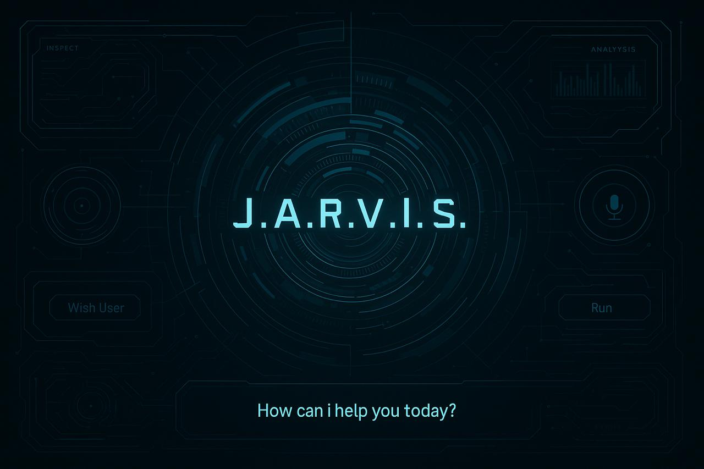

# Jarvis-Voice-Assistant
# 🤖 J.A.R.V.I.S. - Desktop Voice Assistant (Python + Tkinter GUI)

A futuristic, voice-activated desktop assistant with a sleek graphical interface built using **Python**, **Tkinter**, and **speech recognition**. Inspired by Tony Stark’s Jarvis, this assistant can talk, search Wikipedia, play songs, tell time/date, open websites, and more.



## 🧠 Features

- 🎙️ Voice command support
- 📅 Tells time and date
- 📚 Wikipedia integration
- 🎵 Play songs on YouTube
- 🌐 Opens websites like Google, YouTube
- 🌦️ Opens weather info in browser
- 💬 Text-to-Speech feedback
- 🖼️ Custom background GUI with `jarvis_bg.jpg`

## 🛠️ Technologies Used

- Python 3.10+
- Tkinter (GUI)
- pyttsx3 (Text to Speech)
- speechrecognition (Voice input)
- pywhatkit (YouTube & web actions)
- Wikipedia (info lookup)
- Pillow (image handling)

## 📦 Installation

1. **Clone this repository**:

```bash
git clone https://github.com/Subhoisalive/jarvis-assistant.git
cd jarvis-assistant
